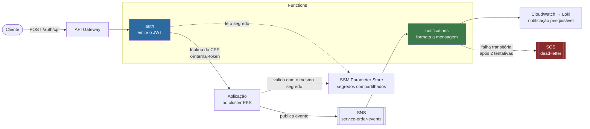

# Functions serverless — Tech Challenge Fase 3

Duas functions com responsabilidades distintas, no mesmo repositório e com ciclo de vida
independente.

---

## Para que servem

| Function | Natureza | O que faz |
|---|---|---|
| **`auth`** | síncrona, atrás do API Gateway | recebe um CPF, consulta a aplicação e **emite o JWT de cliente** |
| **`notifications`** | assíncrona, reage ao SNS | formata e entrega notificações de ordem de serviço |

A `auth` existe porque **emitir o token de cliente é a única responsabilidade do sistema que não
existe em nenhum outro lugar** (ADR-002). A aplicação valida tokens desde a Fase 2; quem os emite
para o cliente é esta function.

A `notifications` existe porque assinar o tópico de eventos direto com um destinatário entregaria o
**JSON cru** do evento. A formatação é a razão de ela existir.

## O que estas functions **não** fazem

Essa fronteira é deliberada:

- **nenhuma acessa o banco.** A `auth` consulta a aplicação por HTTP; a `notifications` usa o que vem
  no evento. Nenhuma tem `vpc_config`, e isso é consequência direta do ADR-002
- **nenhuma importa código da aplicação.** O acoplamento é o contrato escrito (RFC-003 e ADR-003),
  não código compartilhado — são repositórios com versionamento próprio
- **a `notifications` não envia e-mail.** O ambiente é de demonstração e não há destinatário real

---

## Arquitetura



**Os segredos ficam no SSM, e isso resolve um problema concreto.** O `JWT_SECRET` precisa ser
idêntico nos dois lados: a function assina, a aplicação valida. Copiar o mesmo texto para dois
lugares cria duas fontes de verdade, e o modo de falha é ruim — o token é assinado com sucesso e
recusado do outro lado, com erro que não aponta para a causa.

---

## Tecnologias

| Ferramenta | Versão | Onde |
|---|---|---|
| Node.js | **22** | runtime das duas |
| TypeScript | 5.3 | ambas |
| esbuild | 0.24 | bundle de cada function |
| Jest + ts-jest | 29 | testes, cobertura mínima de 80% |
| `jsonwebtoken` | 9 | **só a `auth`** |
| Terraform | >= 1.10 | provisionamento |

**O runtime não é escolha estética.** `nodejs20.x` foi deprecado pela AWS em 30/abr/2026 — sem
patches de segurança, e criação de novas functions bloqueada a partir de fev/2027. Conferir antes de
mudar:

```bash
aws lambda list-functions --query 'Functions[].Runtime' --output text
```

### As dependências são a prova de que os projetos são independentes

```
auth          -> jsonwebtoken
notifications -> nenhuma
```

Cada uma tem `package.json`, `tsconfig.json`, `jest.config.js`, `node_modules` e `dist` próprios. A
`notifications` **não carrega `jsonwebtoken`**, e não depende de SDK da AWS.

---

## Execução local

```bash
cd functions/auth          # ou functions/notifications
npm install
npm test                   # testes
npm run test:coverage      # cobertura, mínimo de 80%
npm run build              # gera dist/index.js
```

As duas rodam sem AWS: os testes compõem as dependências à mão, sem tocar em rede.

### Verificar o bundle antes de publicar

```bash
node -e "const m = require('./dist/index.js'); console.log(typeof m.handler)"
```

Precisa imprimir `function`. Sem o export, a function faz deploy com sucesso e quebra em **toda**
invocação com `Runtime.HandlerNotFound` — falha que os testes de composição não pegam, porque eles
importam `createHandler`.

---

## Deploy

| Evento | O que roda |
|---|---|
| PR que toca `functions/auth/**` | testes, cobertura, build e verificação do bundle **só da `auth`** |
| PR que toca `functions/notifications/**` | o mesmo, **só da `notifications`** |
| Merge na `main` | build, `terraform apply`, e **invocação real** da function alterada |

O filtro de caminho é o que torna a independência real: mexer numa function não roda o CI da outra.

O CD **não confia no apply**: depois de publicar, ele invoca a function e falha se vier
`FunctionError`. Apply verde prova que a AWS aceitou o pacote, não que o código funciona.

### Pré-requisitos

A credencial do Learner Lab nos secrets do repositório, e `APP_BASE_URL` apontando para o API
Gateway. A credencial expira em ~4h e **é revogada quando a sessão do lab para**.

---

## Runbook

### Publicar manualmente

```bash
cd functions/auth && npm ci && npm run build && cd ../..
cd terraform && terraform init && terraform apply
```

### Testar a `auth`

```bash
aws lambda invoke --function-name car-repair-shop-auth \
  --payload "$(echo -n '{"body":"{\"cpf\":\"12345678909\"}"}' | base64 -w0)" \
  /dev/stdout
```

| Situação | Resposta |
|---|---|
| Sucesso | `200` com `{ token, expiresIn, customer }` |
| Corpo ou `cpf` ausente | `400` |
| Cliente não encontrado | **`401`** |
| Cliente inativo | `403` |
| Aplicação inalcançável | `503` |

**O `401` para cliente não encontrado é decisão de segurança.** Devolver `404` transformaria o
endpoint num oráculo de enumeração — daria para descobrir quem é cliente da oficina testando CPFs.

### Testar a `notifications`

```bash
aws sns publish --topic-arn "$(cd terraform && terraform output -raw sns_topic_arn)" \
  --message '{"eventType":"BUDGET_READY","occurredAt":"2026-08-30T12:00:00Z",
              "serviceOrder":{"id":"os-1","status":"AGUARDANDO_APROVACAO","budgetTotal":1499.9},
              "customer":{"id":"c1","name":"Ana","email":"ana@exemplo.com"}}'
```

E conferir o log:

```bash
aws logs tail /aws/lambda/car-repair-shop-notifications --follow
```

### Conferir a dead-letter

```bash
aws sqs get-queue-attributes \
  --queue-url "$(cd terraform && terraform output -raw notifications_dlq_url)" \
  --attribute-names ApproximateNumberOfMessages
```

**Mensagem ali significa problema.** Payload inválido é erro permanente e deve ser descartado com
registro, não retentado — se aparecer na fila, a distinção entre erro permanente e transitório
quebrou.

### Obter os segredos

```bash
aws ssm get-parameter --name /car-repair-shop/auth/jwt-secret \
  --with-decryption --query Parameter.Value --output text
```

---

## O comportamento de reentrega da `notifications`

É a decisão de design da function, e vale conhecer antes de mexer nela:

| Erro | Exemplo | Comportamento | Por quê |
|---|---|---|---|
| **Permanente** | payload malformado, tipo desconhecido | registra e segue | relançar reprocessaria **para sempre** um evento que nunca vai funcionar |
| **Transitório** | canal de entrega fora | relança | é o que faz o retry do SNS agir |

Confundir os dois custa nos dois sentidos: relançar erro permanente queima invocação até a
dead-letter, e engolir erro transitório perde a notificação em silêncio.

O SNS pode entregar **mais de um registro por invocação**. Tratar só o primeiro é o erro clássico
aqui, e passa despercebido em teste com um registro só.

---

## Custo

As duas functions custam **praticamente zero**: a Lambda tem free tier de 1 milhão de invocações por
mês, e o SNS e o SQS deste volume ficam dentro da faixa gratuita. Os grupos de log têm retenção de 1
dia — sem isso, a Lambda cria com retenção infinita, e log que ninguém apaga vira custo que ninguém
nota.

---

## Repositórios relacionados

| Repositório | Papel |
|---|---|
| [fiap-tech-challenge](https://github.com/diandria/fiap-tech-challenge) | a aplicação: expõe o lookup, valida o token, publica os eventos |
| [fiap-tech-challenge-infra-k8s](https://github.com/diandria/fiap-tech-challenge-infra-k8s) | o API Gateway que roteia `POST /auth/cpf` para a `auth` |

A relação com a aplicação é bidirecional e vale entender:

- a **`auth` chama** o endpoint interno `POST /auth/customers/lookup`, autenticando-se com o
  `x-internal-token`. Esse endpoint **não é exposto no API Gateway**, por decisão registrada no M7
- a **aplicação valida** o token que a `auth` assina, lendo o mesmo segredo do SSM
- a **aplicação publica** no tópico que a `notifications` consome

A documentação da API da aplicação — **Swagger** em `/docs` — descreve os endpoints envolvidos.
